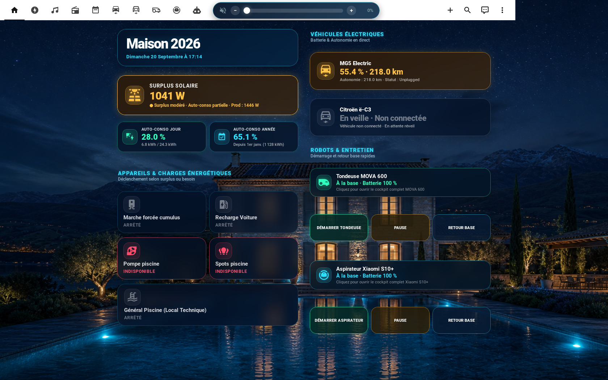

# 🕹️ Borne Arcade Home Assistant (Batocera Kiosk)

[](https://batocera.org)
[](https://www.home-assistant.io)
[](https://www.python.org)
[](https://webkitgtk.org)

Intégration complète et autonome de **Home Assistant** en mode Kiosk plein écran sur une borne d'arcade sous **Batocera Linux**, avec supervision d'inactivité, retour instantané à EmulationStation sur manipulation du joystick ou appui bouton, et affichage en temps réel de la gestion énergétique solaire de la maison.

---

## 📸 Aperçu du Rendu Réel sur la Borne (1680 × 1050)



---

## ⚡ Fonctionnalités Clés

1. **Affichage Kiosk Plein Écran Haute Performance :**
   - Moteur **GTK3 + WebKit2 4.1** avec accélération matérielle Wayland (`:0`).
   - Masquage automatique du curseur de la souris.
   - Zoom configurable pour s'adapter à la résolution d'écran (1680 × 1050 16:10).

2. **Connexion Automatique Intelligente (Auto-Login) :**
   - Détection automatique de la page d'authentification Home Assistant.
   - Remplissage transparent des champs de connexion (même à l'intérieur des Shadow DOM de Home Assistant).
   - Validation de la case *"Rester connecté"* et soumission automatique sans intervention clavier/souris.

3. **Maintien du Rafraîchissement en Temps Réel (Anti-Sommeil & Watchdog) :**
   - **Polyfill anti-suspension :** empêche WebKit de geler le document ou de couper les connexions en arrière-plan (`suspendWhenHidden = false`, `visibilityState = visible`).
   - **Propagation continue des états :** injecte l'objet `hass` directement aux composants Lovelace pour garantir un affichage instantané de la production solaire, du surplus et de la domotique.
   - **Watchdog d'auto-guérison :** vérifie la réactivité du WebSocket toutes les 30 secondes et recharge automatiquement l'interface en cas de déconnexion réseau prolongée (> 2 min).

4. **Supervision d'Inactivité & Gestion des Jeux :**
   - **Démon d'inactivité (`ha_daemon.py`) :** attend que Batocera et EmulationStation soient totalement initialisés au démarrage.
   - **Sortie instantanée :** dès qu'un joueur touche un bouton d'arcade ou déplace le joystick, le kiosk se ferme immédiatement pour afficher EmulationStation.
   - **Détection des émulateurs :** le kiosk ne s'ouvre jamais lorsqu'une partie de jeu est en cours.
   - **Réouverture automatique :** dès que la borne reste inactive pendant la durée configurée (par défaut 90 secondes), Home Assistant réapparaît.

5. **Indicateurs Solaire & Énergie en Temps Réel :**
   - **Surplus Solaire XXL** avec code couleur dynamique (vert si surplus fort > 1500W, orange si modéré, rouge si soutirage réseau).
   - **Taux d'Autoconsommation Journalier** (`%` en direct, kWh consommés / kWh produits).
   - **Taux d'Autoconsommation Annuel** (depuis le 1er janvier de l'année en cours).

---

## 📁 Structure du Dépôt

```text
Borne_Arcade_HA/
├── batocera/
│   └── userdata/
│       └── system/
│           ├── scripts/
│           │   ├── ha_kiosk.py              # Navigateur Kiosk GTK3/WebKit2 avec auto-login et sortie joystick
│           │   └── ha_daemon.py             # Démon de veille et supervision d'inactivité
│           ├── configs/
│           │   └── ha_kiosk/
│           │       ├── ha_kiosk.conf        # Fichier de configuration actif (URL, comptes, délais)
│           │       └── ha_kiosk.conf.example # Modèle de configuration
│           ├── services/
│           │   └── ha_kiosk                 # Script de gestion du service Batocera (start/stop/restart/status)
│           └── custom.sh                    # Hook d'autostart Batocera au boot
├── homeassistant/
│   ├── dashboards/
│   │   └── maison-2026.yaml                 # Dashboard Lovelace complet optimisé pour la borne
│   └── sensors/
│       ├── autoconsommation_sensors.yaml    # Capteurs templates Jinja2 pour l'autoconsommation
│       └── utility_meter.yaml               # Compteurs journaliers et annuels pour l'énergie
├── docs/
│   └── screenshots/
│       └── arcade_screen_final.png          # Capture d'écran réelle sur la borne
├── deploy.sh                                # Script d'installation et déploiement 1-clic pour Batocera
└── README.md
```

---

## 🚀 Déploiement Rapide sur Batocera (1 commande)

Connectez-vous en SSH à votre borne Batocera (par exemple `ssh root@192.168.1.102` avec le mot de passe `linux`) et lancez :

```bash
curl -sSL https://raw.githubusercontent.com/rudelj/Borne_Arcade_HA/main/deploy.sh | bash
```

Ou en clonant le dépôt :

```bash
cd /tmp
git clone https://github.com/rudelj/Borne_Arcade_HA.git
cd Borne_Arcade_HA
chmod +x deploy.sh
./deploy.sh
```

Le script s'occupe de :
1. Créer l'ensemble des répertoires sous `/userdata/system/`.
2. Déployer `ha_kiosk.py`, `ha_daemon.py`, et le script de service `ha_kiosk`.
3. Configurer `custom.sh` et activer le service au démarrage de Batocera.
4. Rendre tous les scripts exécutables et sauvegarder l'overlay persistant (`batocera-save-overlay`).
5. Démarrer immédiatement le service.

---

## ⚙️ Configuration (`ha_kiosk.conf`)

Le fichier de configuration est situé sur Batocera dans `/userdata/system/configs/ha_kiosk/ha_kiosk.conf` :

```ini
# Configuration Kiosk Home Assistant pour Borne d'Arcade Batocera

# URL Home Assistant à afficher en plein écran (Vue Accueil optimisée 1680x1050)
HA_URL="https://ha.wecoachimmo.fr/maison-2026/accueil"

# Identifiants de connexion Home Assistant (auto-login automatique)
HA_USER="rudel"
HA_PASSWORD="VotreMotDePasse"

# Temps d'inactivité en secondes avant de réafficher Home Assistant quand on ne joue pas sur EmulationStation
INACTIVITY_TIMEOUT=90

# Quitter Home Assistant lors d'un mouvement du joystick arcade (true) ou seulement sur appui bouton (false)
EXIT_ON_JOYSTICK_MOVE=true

# Zoom de la page Web (1.0 = 100%, 1.1 = 110%, 0.9 = 90%)
WEB_ZOOM=1.0
```

Pour appliquer toute modification de configuration :
```bash
/userdata/system/services/ha_kiosk restart
```

---

## 🛠️ Commandes Utiles & Maintenance

### Gestion du service sur Batocera :
- **Vérifier l'état :** `/userdata/system/services/ha_kiosk status`
- **Redémarrer le service :** `/userdata/system/services/ha_kiosk restart`
- **Arrêter temporairement :** `/userdata/system/services/ha_kiosk stop`
- **Démarrer :** `/userdata/system/services/ha_kiosk start`

### Consulter les journaux (logs) :
```bash
tail -f /userdata/system/logs/ha_daemon.log
```

### Tester l'affichage manuellement en direct :
```bash
WAYLAND_DISPLAY=wayland-1 XDG_RUNTIME_DIR=/var/run DISPLAY=:0 GIO_EXTRA_MODULES=/userdata/system/lib/gio/modules python3 /userdata/system/scripts/ha_kiosk.py
```

### Prendre une capture d'écran du rendu réel :
```bash
WAYLAND_DISPLAY=wayland-1 XDG_RUNTIME_DIR=/var/run grim /tmp/capture_ecran.png
```

---

## 🏠 Configuration Côté Home Assistant

### 1. Capteurs d'Autoconsommation (`configuration.yaml`)
Copiez le contenu de [`homeassistant/sensors/autoconsommation_sensors.yaml`](homeassistant/sensors/autoconsommation_sensors.yaml) et [`homeassistant/sensors/utility_meter.yaml`](homeassistant/sensors/utility_meter.yaml) dans votre fichier `configuration.yaml`.

- **Capteur journalier :**
  $$\text{Taux Jour} = \frac{\text{Prod Jour} - \text{Injection Jour}}{\text{Prod Jour}} \times 100$$
- **Capteur annuel :**
  $$\text{Taux Annuel} = \frac{\text{Prod 2026} - \text{Injection 2026}}{\text{Prod 2026}} \times 100$$

### 2. Dashboard Lovelace (`maison-2026.yaml`)
Le dashboard complet prêt à l'emploi est disponible dans [`homeassistant/dashboards/maison-2026.yaml`](homeassistant/dashboards/maison-2026.yaml). Il intègre les cartes au format glassmorphism néon calibrées pour les proportions 16:10 de l'écran d'arcade.
